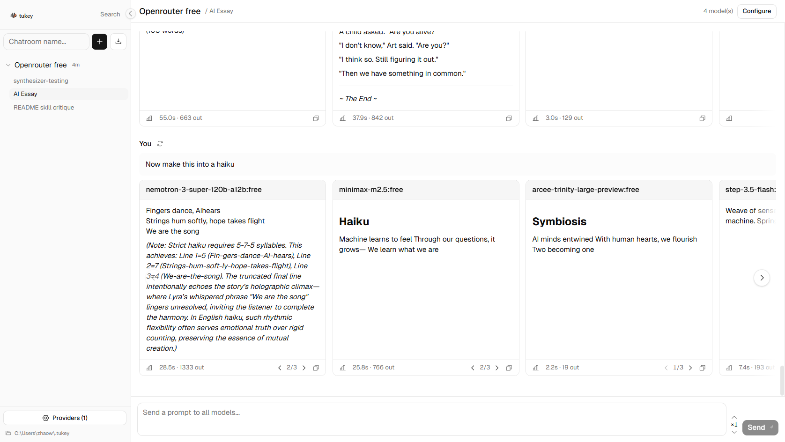

# Tukey

Compare LLM responses side-by-side with local persistence.

```
pipx install tukey-llm
tukey
```

Open `http://localhost:8000`. A guided setup walks you through connecting your first provider — or bring your own API keys.



## What it does

Send a prompt once, get parallel streaming responses from every model you selected. Configure each model independently — system prompt, temperature, max tokens, reasoning effort — or broadcast settings across all of them.

- **Side-by-side comparison** — parallel fan-out to any mix of OpenAI, Anthropic, Google, DeepSeek, or OpenAI-compatible providers
- **Multiple completions** — generate 1–9 completions per model per prompt to observe variance, not just a single sample
- **Per-response metadata** — tokens, cost, duration, tok/s for every response
- **Local-first** — all data stored in `~/.tukey/`, nothing leaves your machine except API calls
- **Experiments** — named test suites with batch execution, human annotation, and reproducible manifests (API/CLI — UI coming soon)
- **Text annotation** — select text in any response to rate and comment on specific sections; highlights persist across page reloads
- **Search** — full-text search across all chatrooms, chats, and messages
- **Import/export** — per-chatroom JSON export for backup or transfer

## Install

Requires Python 3.11+.

```bash
# With pipx
pipx install tukey-llm

# Or with uv
uv tool install tukey-llm
```

Verify it works:

```bash
tukey
# Tukey is running at http://localhost:8000
```

### Options

```
tukey --port 9000          # different port (default: 8000)
tukey --host 127.0.0.1     # bind to localhost only
tukey --data-dir ./my-data  # custom data directory (default: ~/.tukey)
```

## Configuration

On first launch, a guided setup helps you connect your first provider. The fastest path is **OpenRouter** — one API key gives you access to Claude, GPT, Gemini, and more (including free models).

Alternatively, click **"I already have API keys"** to add any provider directly:

| Provider | What to enter |
|----------|--------------|
| OpenRouter | API key from openrouter.ai/keys (recommended — access to 100+ models) |
| OpenAI | API key from platform.openai.com |
| Anthropic | API key from console.anthropic.com |
| Google AI | API key from aistudio.google.dev |
| OpenAI-compatible | Base URL + API key (local servers, custom gateways, etc.) |

Keys are stored in `~/.tukey/config.json`. They are never sent anywhere except to the provider's API. You can switch data directories at runtime via the folder path in the sidebar.

## Usage

1. Create a chatroom
2. Add models from the sidebar — pick any combination across providers
3. Configure each model's system prompt, temperature, and other settings (or use "Apply to all")
4. Type a prompt and send — responses stream in side-by-side
5. Toggle the metadata bar to see cost, speed, and token counts per response

### Annotations

Select any text in a completed response to annotate it:

1. Highlight a text range in a response card
2. Rate it thumbs up or thumbs down, add an optional comment
3. Annotations appear as colored highlights (green = positive, red = negative)
4. Click a highlight to review, edit, or delete the annotation

Annotations are stored per-response and survive page refresh.

### Experiments

For systematic evaluation beyond ad-hoc chat:

1. Define a named experiment with test cases and evaluation criteria
2. Run the test suite — Tukey executes all cases across all models with concurrency
3. Have domain experts annotate results with pass/fail judgments and notes
4. Export the full manifest for reproducibility

### REST API

Drive Tukey programmatically via its REST API. Use any HTTP client:

```python
import httpx

BASE = "http://localhost:8000"

with httpx.Client(timeout=120) as client:
    # List chatrooms
    chatrooms = client.get(f"{BASE}/api/chat/chatrooms").json()
    chatroom_id = chatrooms[0]["id"]

    # Create a chat session
    chat = client.post(f"{BASE}/api/chat/chatrooms/{chatroom_id}/chats").json()

    # Send a message — fans out to all configured models concurrently
    turn = client.post(
        f"{BASE}/api/chat/chatrooms/{chatroom_id}/chats/{chat['id']}/messages",
        json={"content": "Your prompt here"},
    ).json()

    for response in turn["responses"]:
        print(response["model_id"], response["content"])
```

See `GET /api/health` for a quick sanity check. Full endpoint reference: start the server and visit `http://localhost:8000/docs`.

## Contributing

```bash
git clone https://github.com/zhao-weijie/tukey.git
cd tukey
uv sync --extra dev
cd ui && npm ci && npm run build && cd ..
uv run tukey
```

Tests: `uv run pytest`

## License

MIT
