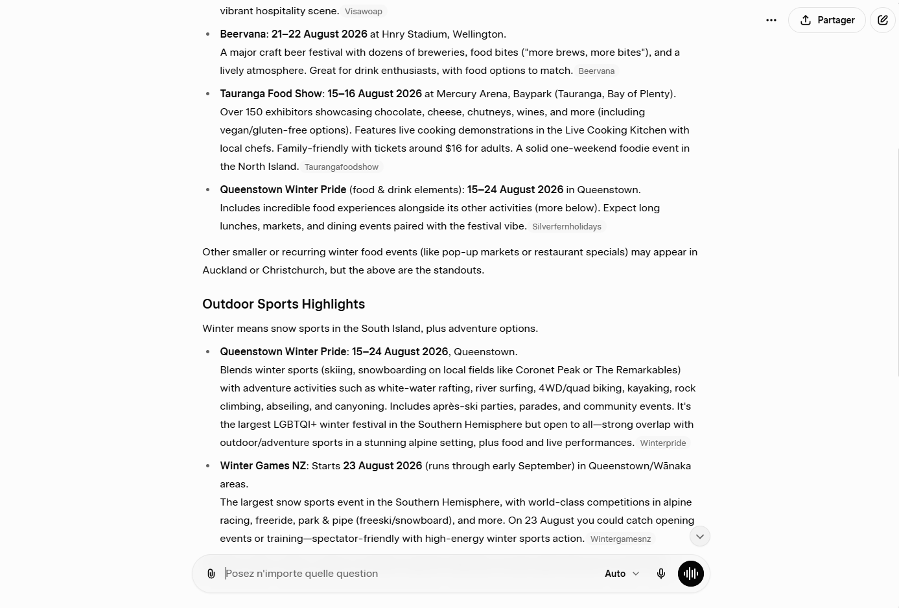
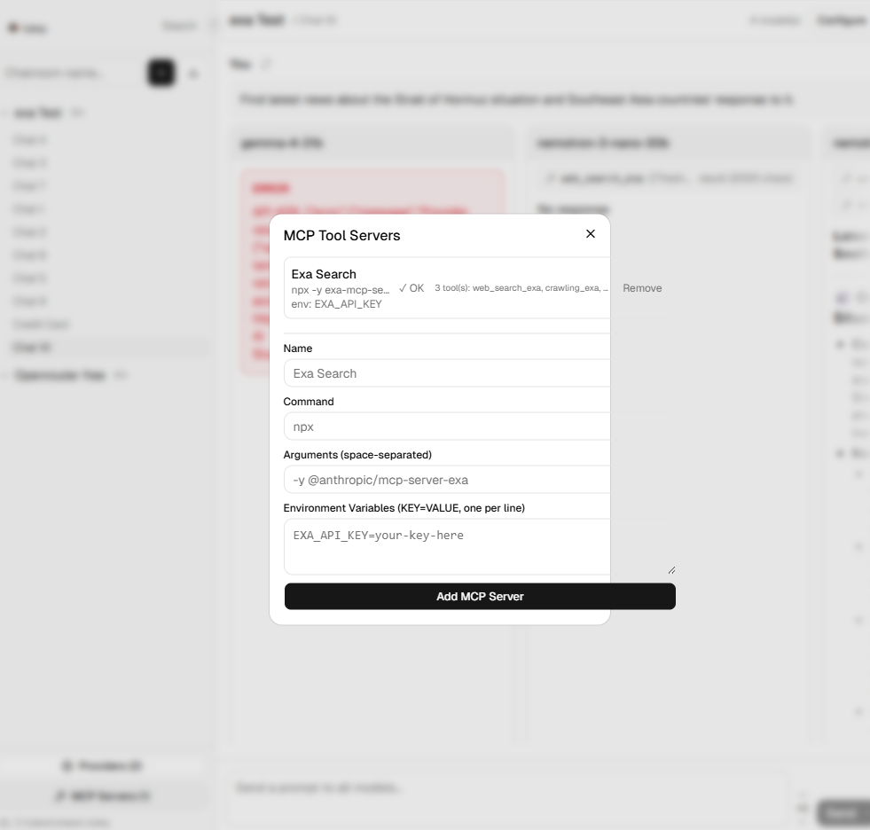

## (bug) Navigating away from a streaming chat, then returning results in a blank screen
Severity: Major

Start a new chat in a configured chatroom; send a message; navigate to another chat when first token has not arrived yet; navigate back; blank screen instead of in-progress stream observed - does not even have user message.

In fixing this bug, more issues were created. If there is a single error-ed response, the Response Cards are repeated below and remain in the "Streaming..." state.


## (bug) Having more than 3 model configurations expands the right panel container beyond the visible screen area
Severity: Major

Impact: Unable to access "Hide Config" button. Expected behavior: Model configurations that overflow behave similarly to ResponseCarousel which allow horizontal scrolling. The top bar that contains the "Hide Config" button and the chatroom/chat name needs to strictly fill only the available screen width (after accounting for the left sidenav).

## (bug) Clicking the "Browse" button in the DirectoryDialog displays a "failed to fetch" error
Severity: Major
Looking at the server console revealed this error

```
*** Terminating app due to uncaught exception 'NSInternalInconsistencyException', reason: 'NSWindow should only be instantiated on the main thread!'
*** First throw call stack:
(
        0   CoreFoundation                      0x000000018585d8ec __exceptionPreprocess + 176
        1   libobjc.A.dylib                     0x0000000185336418 objc_exception_throw + 88
        2   CoreFoundation                      0x0000000185878ec4 _CFBundleGetValueForInfoKey + 0
        3   AppKit                              0x000000018a8fed0c -[NSWindow _initContent:styleMask:backing:defer:contentView:] + 260
        4   AppKit                              0x000000018a8ff114 -[NSWindow initWithContentRect:styleMask:backing:defer:] + 48
        5   libtk8.6.dylib                      0x00000001086306bc TkMacOSXMakeRealWindowExist + 592
        6   libtk8.6.dylib                      0x0000000108630308 TkWmMapWindow + 96
        7   libtk8.6.dylib                      0x000000010858982c MapFrame + 96
        8   libtcl8.6.dylib                     0x000000010849f650 TclServiceIdle + 72
        9   libtcl8.6.dylib                     0x000000010847cf58 Tcl_DoOneEvent + 268
        10  libtk8.6.dylib                      0x0000000108621618 TkpInit + 792
        11  libtk8.6.dylib                      0x0000000108581f7c Initialize + 2368
        12  _tkinter.cpython-311-darwin.so      0x00000001005fa57c Tkapp_New + 936
        13  _tkinter.cpython-311-darwin.so      0x00000001005f9fb8 _tkinter_create + 624
        14  libpython3.11.dylib                 0x00000001017f16fc cfunction_vectorcall_FASTCALL + 80
        15  libpython3.11.dylib                 0x00000001015cec90 _PyEval_EvalFrameDefault + 183844
        16  libpython3.11.dylib                 0x000000010170f664 _PyFunction_Vectorcall + 472
        17  libpython3.11.dylib                 0x00000001017f935c slot_tp_init + 276
        18  libpython3.11.dylib                 0x00000001017fc5d0 type_call + 136
        19  libpython3.11.dylib                 0x00000001015cf18c _PyEval_EvalFrameDefault + 185120
        20  libpython3.11.dylib                 0x000000010170f664 _PyFunction_Vectorcall + 472
        21  libpython3.11.dylib                 0x00000001015d2dd4 _PyEval_EvalFrameDefault + 200552
        22  libpython3.11.dylib                 0x000000010170f664 _PyFunction_Vectorcall + 472
        23  libpython3.11.dylib                 0x00000001017dc1fc method_vectorcall + 340
        24  libpython3.11.dylib                 0x000000010185bff0 thread_run + 220
        25  libpython3.11.dylib                 0x0000000101d0cac8 pythread_wrapper + 48
        26  libsystem_pthread.dylib             0x0000000185771c08 _pthread_start + 136
        27  libsystem_pthread.dylib             0x000000018576cba8 thread_start + 8
)
libc++abi: terminating due to uncaught exception of type NSException
```

## (improvement) Allow per-model manual retries and additional responses
Priority: high
Problem: Some models fail while others succeed sometimes due to model quality or API/provider issues. It is not currently possible to retry just for the failed models.

The first successful response should be shown as default.

## (improvement) Resume streaming after navigating away and back
Priority: high
Problem: When a user navigates away from a chat mid-stream and returns, they see skeleton placeholders instead of live streaming. The backend continues streaming (in-flight tasks run to completion), but the new WebSocket connection cannot receive those chunks.

Proposed solution: Add a module-level stream registry in `websocket.py` that maps `(chatroom_id, chat_id)` to a mutable sender reference + accumulated content per model. When a new WebSocket connects to a chat with an active stream: (1) swap the sender so in-flight tasks send chunks to the new connection, (2) send a `stream_resume` catch-up message with all content accumulated so far, (3) continue streaming live. Frontend handles the new `stream_resume` message type by populating `streaming` state with accumulated content. ~40 lines backend, ~10 lines frontend.

## (improvement) More flexible model/provider/config in a particular configuration "slot" instead of deleting
Priority: normal

## (improvement) Tool Choice and Response Format options in Model Config do not have a "broadcast" option
Priority: normal
## (improvement) Allow individual response cards to be expanded in width for easier reading of long responses
Priority: high

As a user I want to be able to expand individual response cards to make it easier to read long responses.  

## (improvement) Response card layout and comparison UX
Priority: normal

As a user I want to be able to choose which response cards are next to each other so that I can easily compare 2 models' responses side by side.

As a user I want to choose which response cards are currently visible so that I can focus on comparing the responses I care about most.

## (improvement) Stack past responses instead of showing all ResponseCards
Priority: normal

Idea: stack and show only the first pinned response or the one with the most positive annotations for past turns. Only current turn responses are shown in full. This reduces visual clutter. The user gets a button to expand the full Response Carousele to full width.

Related idea: this might work well together with horizontal stack-ranking where the user drags conversation ResponseCards to rank them horizontally. Drag handle rather than the entire ResponseCard component as target should be easier to use.


## (improvement) Chat stats for per-model metadata in a chat
Priority: normal
As a user I want a quick view of how each model performed in the chat so that I can decide which one to use as default.  
When hovering the chat name in the top bar, a popover/dropdown appears showing the stats for each model.

Stats to include: cost, input tokens, output tokens, latency, tok/s, user ratings (positive + negative).

## (improvement) Chat input box and default chat area width for user messages should be narrower and centered.
Priority: normal
As a user I want the chat and message area to be centered in my view so that my eyes do not have to scan left and right too much, reducing eye fatigue. 

Multiple model responses are allowed to take the full width of the chat area container, since it is easier to compare responses side by side.



---
# Not relevant to the codebase, for reference only
## (bug) Antigravity bug

Symptom: Open repo in antigravity, type a prompt and send in both planning and fast mode. Switched to other repository, no change. Switched to agent manager, chat is not created. No response or thinking or any output at all. Same result even after downloading and installing latest version.

---

# RESOLVED

## (bug) Replacing expired key breaks existing configurations
### Severity: Major
Problem: When a key expires, a provider has to be deleted for the new key to be added and the existing configurations break.

Proposed Solution: Add an "edit" feature for keys so that we can replace the key without deleting the provider. Warn user when removing providers about potential effects with a focus modal overlay plus confirm or cancel button choices.

## (bug) Tool call element in ResponseCard.tsx is duplicated in streaming status

Symptom: tool call element is duplicated once (2 elements per tool call) shown when streaming results. When streaming finishes, the extra tool calls disappear.

## (bug) dialog.tsx elements overflow the container when state changes

Symptom: Elements fit within the container width on first load. However, after Searching (for the SearchDialog) and Testing (for the Mcpserversetup), the buttons and text input boxes bleed past the right boundary of the container.


